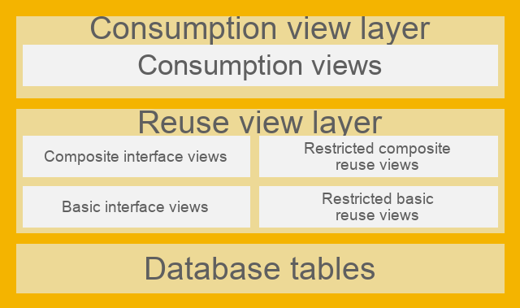

{: .no_toc}
# Core Data Services

1. TOC
{:toc}

What are CDS Views and why are they important? 
In SAP S/4HANA, the developer should no longer access the databases directly, but rather use the [Virtuelle Datenmodell (VDM)](https://help.sap.com/docs/SAP_S4HANA_ON-PREMISE/ee6ff9b281d8448f96b4fe6c89f2bdc8/8573b810511948c8a99c0672abc159aa.html?locale=de-DE) to access the data in SAP S/4HANA, e.g. for analytics or interfaces.  The VDM is represented in SAP S/4HANA by CDS views. These CDS views follow fixed rules for modeling and naming. They represent business data from database tables based on business logic, making the data easier to use. 
[CDS Views are the key elements](https://help.sap.com/doc/abapdocu_cp_index_htm/CLOUD/en-US/abencds.html) for on-stack extensibility or also ABAP Cloud - see [Chapter Clean Core]({{ site.baseurl }}/clean-core/what-is-clean-core/). The use and extension of a data model is the key to the VDM concept. CDS Views are used for many purposes, such as an interface between different applications and add-ons in the same system as well as to external systems and applications. You can also create your own views by using the views provided and shared by SAP as a data source, following the Clean Core thought.

## Construction of the VDM



Source: SAP Help representation of the VDM
{: .img-caption} 

Various CDS view layers are placed in front of the database tables. For example, the VDM ensures that the database fields are understandable and the user can identify the proprietary SAP data model, for example MARA-MATNR, as a product number. The Basic Interface Layer accesses the database. The Composite Interface Views combine logic and basic interface views; the VDM can contain different abstraction layers. The consumption views release the data model for the use case.  
As part of the [ABAP RESTful Application Programming Model](../abap/restful_abap.md) (RAP), SAP also provides further definitions of terms, e.g. Business Object Projection Layer.

Here would be the following list of view types. All standard views also include the identifier/annotation:

```abap
@VDM.viewType:[..]
```
## View types, naming conventions and possible uses  

| View-Typ / Suffix  | Beschreibung | Annotation |
|--------------------|-------------|------------|
| **I_*** | Basic and composite interface views: These CDS views are used to read data and can be used for extensions. | `@VDM.viewType: #BASIC` `@VDM.viewType: #COMPOSITE` |
| **C_*** | Consumption views: Restricted reuse views. | `@VDM.viewType: #CONSUMPTION` |
| **P_*** | Private Views: These views may not be used as SAP can change them during system upgrades. | `@VDM.private: true` |
| **R_*** | Views for transactional processing: These CDS views enable not only reading data, but also actions such as creating, changing or deleting instances of a RAP business object in the context of the ABAP RESTful application programming model (RAP). |    |
| **A_*** | Remote API views: These CDS views form the basis for external APIs. For more information about APIs, see [SAP Business Accelerator Hub](https://api.sap.com/). | `@VDM.viewType: #CONSUMPTION` `@VDM.lifecycle.contract.type: #PUBLIC_REMOTE_API` |
| **X_*** | View extensions: These CDS views can only read data indirectly in the context of another CDS view. They provide access to industry or country/region specific fields defined by SAP. | `@VDM.viewExtension: true` |
| **E_*** | Extension Include Views: These CDS views can only read data indirectly in the context of another CDS view. They provide access to custom fields created in the Custom Fields app. See section “Extensions to SAP Standard CDS Views”  | `@VDM.viewType: #EXTENSION` |
| **F_*** | Derivation functions: Derive context-specific values ​​that can be used to restrict data in analytical queries. For more information, see Derivation Functions for Finance |    |
| **D_*** | Abstract Entities: Form the basis for modeling event signatures and action parameter/outcome structures. |    |


Furthermore, there is the identifier as a suffix depending on the area of ​​application of the CDS view.

| Suffix            | View-Typ | Annotation |
|------------------|--------------------------------|-----------------------------------------------------------|
| **Query, Qry, Q** | Analytische Query-View | `@VDM.viewType: #CONSUMPTION`<br>`@Analytics.query: true` |
| **Cube, C**      | Analytische Cube-View | `@Analytics.dataCategory: #CUBE` |
| **Text, Txt, T** | Language dependent text provider | `@ObjectModel.dataCategory: #TEXT` |
| **TP**          | View for transactional processing | `@VDM.usage.type: [ #TRANSACTIONAL_PROCESSING_SERVICE ]` |
| **VH, StdVH**   | (By default) View for value help | `@ObjectModel.dataCategory: #VALUE_HELP` |

CDS views can be used for many different purposes, such as: B. for building Fiori applications or analyzing data. You can create your own CDS views using many views released by SAP.
To make it easier for you to find the right CDS view, SAP has introduced two features: Supported Functions and Modeling Patterns. These features are specified as annotations and can be defined for each CDS view.
You can see the supported functions and modeling patterns of CDS views in the [View-Browser App](https://fioriappslibrary.hana.ondemand.com/sap/fix/externalViewer/#/detail/Apps('F2170')/S30PCE). In the ABAP Development Tools you will find this information as an annotation at the beginning of each CDS view.

For more details, see [SAP Help](https://help.sap.com/docs/SAP_S4HANA_ON-PREMISE/ee6ff9b281d8448f96b4fe6c89f2bdc8/8a8cee943ef944fe8936f4cc60ba9bc1.html)

{: .note }
> The following SAP community page [ZSCV_SEARCH_CDS_VIEWS](https://github.com/alwinvandeput/zscv_search_cds_views) offers an open source solution for searching CDS views.

## Classification of CDS Views

### Supported features  
According to the SAP, the supported functions indicate what a CDS view can best be used for. A CDS view can have multiple supported functions because it can be suitable for different purposes.  

These features describe the best use of a CDS view. For example, you can use a CDS view as:  
- Datenquelle  
- Target for joins in CDS modeling  
- Data provider for analytical queries  

The supported functions of a CDS view are specified in a single annotation:  

```abap
@ObjectModel.supportedCapabilities: [ ..., ... ].
```

### Modellierungsmuster  

A modeling pattern describes the main purpose of a CDS view. A CDS view can only have one modeling pattern. The value of the modeling pattern may or may not be equal to the value of a supported function.  

The annotation for a modeling pattern looks like this:  

```abap
@ObjectModel.modelingPattern: ...
```

## CDS View modeling options

This section describes the various type definitions, function definitions and data models within ABAP Core Data Services. Elementary types, SQL-based functions (scalar functions) and various view types such as DDIC-based views, view entities and projection views are explained. This is complemented by advanced concepts such as table functions, hierarchies, custom, external and abstract entities as well as tuning objects for optimizing CDS models.


### Typ-Definitionen

#### Simple Types
This allows you to define elementary data types that you can use in CDS objects or in ABAP.

__Beispiel__

```abap
define type myDate : abap.dats
```

Details finden Sie unter [SAP Help (CDS Simple Types)](https://help.sap.com/doc/abapdocu_latest_index_htm/latest/en-US/abencds_simple_types.htm)

#### Enumerated Types
Define an enumerated type with constants. You can use the type and constants in CDS objects.

__Beispiel__

Definition

```js
define type Weekdays : abap.int1 enum
{
    Monday = initial;
    Tuesday = 1;
    Wednesday = 2;
    Thursday = 3;
    Friday = 4;
    Saturday = 5;
    Sunday = 6;
}
```

Verwendung

```abap
define ... as select from ...
{
    ...
}
where
  weekday = Weekdays.#Friday
```

Details finden Sie unter [SAP Help (CDS Enum Types)](https://help.sap.com/doc/abapdocu_latest_index_htm/latest/en-US/abencds_enumeration_types.htm)

## Tabellenfunktionen
Currently SAP only offers the definition of a _scalar function_. There are two different types of functions.
* Analytische Skalarfunktionen
  * This type of function can currently only be defined internally in the SAP. However, you can use the functions provided by SAP.
* SQL-basierte Skalarfunktionen
  * You can define and implement your own functions of this type. The usage is like the built-in SQL functions (such as CONCAT()). A scalar function can have multiple parameters and always has a single return value.
  * You need three development objects for a scalar function:
    * A scalar function definition (CDS object)
    * A scalar function implementation reference, as a link between the definition and the implementation
    * A [AMDP Function](https://help.sap.com/doc/abapdocu_latest_index_htm/latest/en-US/abenamdp_function_methods.htm) representing the implementation of the scalar function

Details finden Sie unter [SAP Help (CDS-Skalarfunktionens)](https://help.sap.com/doc/abapdocu_latest_index_htm/latest/en-US/abencds_scalar_functions.htm)

## Annotations
Annotations can appear anywhere in a CDS object. Where exactly an annotation can or may be specified depends on the annotation. Annotations are intended to enrich the CDS object with metadata, which can then be interpreted by a user. For example, you can provide a CDS view entity with annotations that can ultimately be evaluated by a Fiori Elements app (with a OData service as an intermediate step).

It is even possible to define your own CDS annotations.

Details dazu finden Sie unter [SAP Help (CDS - Definition of Annotations)](https://help.sap.com/doc/abapdocu_latest_index_htm/latest/en-US/abencds_anno_definition.htm)

### Syntax
To specify an annotation, the following syntax applies:

```
@[<]Anno[: value ]
       |[: { subannos } ]
       |[: [ arrelem ] ]
       |[.subAnno[ ... ]]
```

__Beispiel__

```abap
@MainAnnotation.SubAnnotation: 'Value'
```

Details finden Sie unter [SAP Help (CDS DDL - Annotation Syntax)](https://help.sap.com/doc/abapdocu_latest_index_htm/latest/en-US/abencds_annotations_syntax.htm)

### SAP Annotations
The SAP has already defined a wealth of annotations that can be used. There are various areas and aspects that it covers. 

A large part are the [ABAP Annotationen (SAP Help)](https://help.sap.com/doc/abapdocu_latest_index_htm/latest/en-US/abencds_annotations_abap_tables.htm). This allows, among other things, metadata to be specified about the type of data, data access, expandability and semantics of data. These annotations are evaluated by the ABAP runtime.

__Beispiel__

```abap
...
@Semantics.currencyCode
Currency,
...
```

There is also the [Framework-Spezifischen Annotationen (SAP Help)](https://help.sap.com/doc/abapdocu_latest_index_htm/latest/en-US/abencds_annotations_frmwrk_tables.htm). This can be used, for example, to define metadata for OData services, user interfaces or analytics. This form of annotation is not recognized by the ABAP runtime, but by a framework. The prime example in the SAP environment is Fiori Elements.

__Beispiel__

```abap
...
@UI.lineItem: [{ position: 10 }]
Field,
...
```

## Data Definitions

#### What are Data Definitions?
Data Definitions are CDS entities created in the ABAP Development Tools (ADT). They define the structure and behavior of data models based on database tables or other CDS views. They make it possible to model data in an abstract, semantically rich way, regardless of the underlying database technology.

#### DDIC-based views - OBSOLET 
> As of Release 7.55, DDIC based views have been replaced by view entities, which are no longer dependent on DDIC objects. Please use the View Entities. 

A DDIC based view can be created for DDIC database tables, DDIC views and other CDS views. When defining it, you must specify an SQL view name via an annotation, which is generated in the ABAP dictionary as a DDIC view. When the CDS view is activated, a CDS entity and the annotated DDIC view are created or updated. You access the data of the referenced objects via SQL.

__Beispiel__

```abap
@AbapCatalog.sqlViewName: 'CDS_DB_VIEW'
define view ddic_based_view as select from ...
{
  field,
  ...
}
where
  field = 'ABC'
```

Details finden Sie unter [SAP Help (CDS DDIC-Based Views)](https://help.sap.com/doc/abapdocu_latest_index_htm/latest/en-US/abencds_v1_views.htm)

### View Entities
With a CDS view entity you can access fields of a data source (database tables, other CDS entities), as well as: perform calculations, define relationships, enrich metadata with annotations, etc. The view entities serve as the basis for the [ABAP Data Models](https://help.sap.com/docs/abap-cloud/abap-data-models/abap-data-models) and are used by the [ABAP RESTful Application Programming Model](../abap/restful_abap.md). So they are an important component for a modern ABAP development.

__Beispiel__

```abap
view entity view_entity as select from ...
{
  field,
  ...
}
where
  field = 'ABC'
```

Details finden Sie unter [SAP Help (CDS View Entities)](https://help.sap.com/doc/abapdocu_latest_index_htm/latest/en-US/index.htm?file=abencds_v2_views.htm)

### Projection Views
A projection view is based on another CDS view entity and is used for service-specific use cases. These include:
* Transactional queries (relevant for [ABAP RESTful Application Programming Model](/../abap/restful_abap.md))
* Transactional interface (relevant for [ABAP RESTful Application Programming Model](../abap/restful_abap.md))
* Analytical Abfragen

> Details finden Sie unter [SAP Help (CDS Projection Views)](https://help.sap.com/doc/abapdocu_latest_index_htm/latest/en-US/abencds_proj_views.htm)

### Tabellenfunktion
A table function consists of two parts. A CDS entity, which can be used for example with the CDS view entities or projection views, and a [AMDP Function](https://help.sap.com/doc/abapdocu_latest_index_htm/latest/en-US/index.htm?file=abenamdp_function_methods.htm), which represents the implementation of the function. The result of a table function is data sets. An AMDP function can only be used in an environment whose database system supports AMDP (e.g. SAP HANA). With the AMDP Function you can apply platform-specific SQL commands. The advantage is that you can perform specific queries on the database and provide the results as a data source for other CDS entities.

Details finden Sie unter [SAP Help (CDS Tabellenfunktion)](https://help.sap.com/doc/abapdocu_latest_index_htm/latest/en-US/index.htm?file=abencds_table_functions.htm)

### Hierarchies
This type of CDS view allows you to provide hierarchical data. Only parent-child hierarchies are supported. As a basis, a CDS view entity must be specified, which has an association on itself. This association describes the relationship to the parent node. In the field list you can specify fields of the CDS view entity and special hierarchy attributes, e.g. the level of the entry in the hierarchy.

Details finden Sie unter [SAP Help (CDS Hierarchies)](https://help.sap.com/doc/abapdocu_latest_index_htm/latest/en-US/index.htm?file=abencds_f1_define_hierarchy.htm)

### Custom Entities
CDS Custom Entities are non-SQL entities, i.e. they do not create an SQL view on the HANA database. Custom entities are connected via an annotation to a ABAP class where you can implement business logic and data queries that go beyond SQL. For example, data in a file, a BLOB or from a web service. For actual access you need to create a ABAP class that implements a specific interface. In the definition of the CDS Custom Entity you must specify the class via annotation. You also define possible input parameters and the resulting field list there.

However, the use of the CDS Custom Entities is restricted. You cannot use them in conjunction with SELECTs, i.e. neither in another CDS view nor via ABAP-SQL. However, you can define associations on it and offer them in the field list. In general, the custom entities are processed by the RAP query engine and when a query is executed, e.g. in connection with a OData service.

Details finden Sie unter [SAP Help (CDS Custom Entities)](https://help.sap.com/doc/abapdocu_latest_index_htm/latest/en-US/index.htm?file=abencds_custom_entities.htm)

### Abstract Entities
CDS Abstract Entities are non-SQL entities. You can use them as complex data structures for RAP Actions, RAP Functions and RAP Business Events. In other CDS views it is only possible to define associations on these entities. However, access via SQL or to content is not possible.

Details finden Sie unter [SAP Help (CDS Abstract Entities)](https://help.sap.com/doc/abapdocu_latest_index_htm/latest/en-US/index.htm?file=abencds_f1_define_abstract_entity.htm)

### External Entities

CDS External Entities provide a modern way to manage secondary database connections in ABAP Cloud. They enable ABAP programs to retrieve and manipulate data from other database systems using SQL. Unlike traditional secondary connections that are limited only to SAP HANA databases, CDS External Entities support connections to various database systems, including SAP S/4HANA Cloud, SAP BTP ABAP Environment and SAP HANA Cloud, based on the SAP HANA Smart Data Access technology.

Details finden Sie unter [SAP Experten Blog: )](https://community.sap.com/t5/technology-blog-posts-by-sap/abap-cds-release-news-2408-external-entities/ba-p/13784415)

### Tuning objects
Currently SAP only offers one configuration type: Define View Entity Buffer. This allows data buffering to be defined (no buffering, single record, ranges, complete). This setting can impact performance. 

Performance details can also be found here:
See SAP Help pages [SQL Hint](https://help.sap.com/docs/SAP_HANA_PLATFORM/4fe29514fd584807ac9f2a04f6754767/4ba9edce1f2347a0b9fcda99879c17a1.html?locale=en-US&version=2.0.05) and [Tuning Objects](https://help.sap.com/docs/abap-cloud/abap-data-models/tuning-objects)

## Access Control
Using the access controls, you can define which users or group of users have access to certain data by specifying roles, rules and conditions.
CDS views provide access controls via Data Access Controls / Data Control Language (DCL), similar to the classic Authority Check. 

### Eigenschaften  
Access controls in CDS allow you to precisely define which records are accessible to each user.  
- These access controls work in conjunction with the usual SAP permission objects.  
- SAP authorization objects always refer to a specific field in a table and an activity, such as creating, changing or displaying data.  
- Access to a CDS View is controlled via the so-called Data Control Language.  

Whether access control is applied is decided by the following annotation: 
```abap
@AccessControl.authorizationCheck: []
```

The standard VDM always includes access controls. A common approach is to inherit the access controls from the underlying CDS views to your customer-specific CDS views.

__Beispiel__


```abap
define role ZC_BusinesspartnerAddress_DAC {
    grant select on ZC_BusinesspartnerAddress_Custom  
        where inheriting conditions from entity C_BusinesspartnerAddresstp_2;
}
```
There are other features you can check out here:
[SAP ABAP CDS - Access Control Documentation](https://help.sap.com/doc/abapdocu_cp_index_htm/CLOUD/en-US/abencds_access_control.html) 

{: .note }
> Using transaction SACMSEL, authorization check results can be displayed in a simplified manner.

## Associations
CDS entities can be linked to one another using associations. The source is always its own CDS View entity. DDIC tables and other CDS entities can be defined as targets. The information on cardinality and the condition for the link are important. The cardinality determines the relation, e.g. 1:1 or 0:n. The condition determines which fields source and target are connected.
An association is only ever defined in one direction. If you want to connect two entities in both directions, you have to specify the association to the other in both.
The association can also be announced in the field list, which means that users can also access the association.

__Beispiel__

```abap
association [0..*] to OtherView as _Other on _Other.ForeignKeyField = $projection.KeyField
```

{: .important }
> Attention! From release 2023, a different syntax will be used. [See blog post](https://community.sap.com/t5/application-development-and-automation-blog-posts/new-cardinality-syntax-for-performance-optimization-in-abap-cds-and-abap/ba-p/13554546)
>
> Details finden Sie unter [SAP Help (CDS View Entity, SELECT, Associations)](https://help.sap.com/doc/abapdocu_latest_index_htm/latest/en-US/abencds_association_v2.htm)

A special form of the association is a so-called `ASSOCIATION TO PARENT`. This allows you to define a CDS entity as a parent entity. This is particularly relevant in the context of [RAP]({{ site.baseurl }}/abap/restful_abap/). The association in the other direction, i.e. to the child entity, is defined using `COMPOSITION`. You must first enter the association to the parent entity and only then can you enter the association to the child entity.

For details see [SAP Help (ASSOCIATION TO PARENT)](https://help.sap.com/doc/abapdocu_latest_index_htm/latest/en-US/abencds_to_parent_assoc_v2.htm) and [SAP Help (COMPOSITION)](https://help.sap.com/doc/abapdocu_latest_index_htm/latest/en-US/abencds_composition_v2.htm)

## Extensibility
### Stability contracts  
To ensure the reliable use of CDS views, SAP has introduced three stability contracts (release contracts). These contracts define how CDS views can be used in different usage scenarios:  

1. **Contract for Extensions (C0):** For the use and adaptation of existing views.  
2. **Contract for system-internal use (C1):** For views within the same system.  
3. **Agreement for Remote API Use (C2):** For the use of Views by external systems and applications.  

For more information, see [Stability contracts for CDS views](https://help.sap.com/docs/SAP_S4HANA_ON-PREMISE/ee6ff9b281d8448f96b4fe6c89f2bdc8/2e4edbede2f94fb7b7f6eac856c02b19.html?locale=de-DE).  

### Extensions of SAP standard CDS views
A big advantage is the ability to expand any CDS views with the contract for extensions (C0) and higher. A CDS view classified with the C0 contract for extensions provides stable points for extensions. SAP guarantees stability, so S/4HANA upgrades cannot result in incompatible changes. But this also poses a danger! For example, if you use fields from an existing CDS view in your extended CDS view (ZE_*), then these can be changed during S/4HANA upgrades. Make sure to only "add" CDS views in the designated E_* CDS views. We recommend this [Learning Journey by SAP](https://learning.sap.com/learning-journeys/acquire-core-abap-skills/extending-cds-views_fab548c5-6438-41e1-8384-c5190f13ea7b), the facts are explained here.

## BW integration, embedded analytics and ODP
The Operational Data Provisioning Framework (ODP) enables the transfer of data from various SAP repositories to SAP BW, SAP BW/4HANA and other systems or services. CDS Views can serve as a source for data extraction.  

#### Requirements for the transfer to SAP BW/4HANA 
The classic CDS View or CDS View Entity should have the following annotations:  
- `@Analytics.dataCategory`  
- `@Analytics.dataExtraction.enabled`  

### Requirements for Embedded Analytics
Embedded analytics doesn't just work in the Analytical Fiori apps or via the key user extensibility apps. Direct consumption of a CDS view, through the Online Analytical Processing (OLAP) engine, is also possible directly in the Business Intelligence (BI) tools. In particular the SAP Analytic Cloud (SAC), but also Analysis for Office (AO).

For more information, see [in this blog entry](https://community.sap.com/t5/enterprise-resource-planning-blogs-by-members/sap-s-4hana-embedded-analytics-an-overview/ba-p/13530854#:~:text=It%20is%20a%20collection%20of%20SAP%20Fiori%20tiles,as%20Fiori%20analytical%20apps%20for%20various%20functional%20areas.). 

Here would be the structure to consume a CDS view directly from the SAC, for example.
To do this, two additional CDS views must be created and provided with the annotation.
1. Composite CDS View (Entity) `@Analytics.dataCategory: #CUBE / '#FACT / #DIMENSION` 
2. Consumption CDS View (Entity) `@Analytics.query: true` 


Musteraufbau: Direkter Zugriff vom SAC 
{: .img-caption}

It should be noted that a **contract for system-internal use (C1)** must be assigned for the Consumption CDS View.
In addition, the following authorization objects are required in the user roles.

```
S_RS_COMP
		RSINFOAREA   *
		RSINFOCUBE   *
		RSZCOMPTP		REP (for analytical reporting) / SOB (for planning functions)
		RSZCOMPID		2C<SQLViewName of Analytical Query>
		ACTVT				03, 16

S_RS_COMP1
		RSZCOMPID		2C<SQLViewName of Analytical Query>
		RSZCOMPTP		REP (for analytical reporting) / SOB (for planning functions)
		RSZOWNER		 * (Only in the catalog role not in authorization default)
		ACTVT				03,16
  
S_RS_AUTH
		BIAUTH		  0BI_ALL
```

For more information, see [SAP Help Portal](https://help.sap.com/docs/SAP_BW4HANA/107a6e8a38b74ede94c833ca3b7b6f51/af11a5cb6d2e4d4f90d344f58fa0fb1d.html). 

### Funktionsweise ODP
The ODP interface enables access to transaction data and master data (attributes, texts, hierarchies). The SAP BW/4HANA system subscribes to operational delta queues and replicates the data. The data change sources also support delta processes.

For more information, see [SAP Help Portal](https://help.sap.com/docs/SAP_BW4HANA/107a6e8a38b74ede94c833ca3b7b6f51/202710d1cee84333a4f4d593324bdf51.html).  

## Tips and Trick

{: .recommendation }  
> 1. Performance Tracing - Always examine every CDS view! No matter whether SAP standard or self-created. You can trace the SQL execution using an SQL trace in ST05. To do this, you must extract the .PLV file and display it in Eclipse. This allows you to analyze time distributions and execution plans. Be sure to check the total number of records returned to identify design issues. 
> [See DSAG Eclipse ADT Guides - Performance "Selecting a concrete selection"](https://1dsag.github.io/ADT-Leitfaden/troubleshooting/performance-analysis/)
> 2. Massive JOINs and complex queries - For massive JOINs (e.g. 7-14 tables), CDS views can be more efficient by splitting them into layers with associations to improve performance. For complex queries, CDS views allow code pushdown, but be careful with AMDPs on large tables (>1 million entries) as this can impact performance.
> Please note that AMDPs select per table row. What selection do you have going into the AMDP?
> 3. Fast Queries - Keep selections small and specific to optimize performance and avoid AMDPs on large tables to speed up database access. We recommend the [Note 2000002 - FAQ: SAP HANA SQL Optimization](https://me.sap.com/notes/2000002).
> If the optimization should take place on the SQL engine itself, please use this page [HINT Details](https://help.sap.com/docs/SAP_HANA_PLATFORM/4fe29514fd584807ac9f2a04f6754767/4ba9edce1f2347a0b9fcda99879c17a1.html?locale=en-US&version=2.0.05).
> 4. Check potential for a SAC query - BAPIs, function modules or ABAP SQL are often more suitable for repeated, user-defined data queries, as CDS views are intended for standardized, reusable models. For SAC reports, CDS Views are particularly useful because they can be consumed directly by SAC.
> 5. Providing data to subsystems - RAP can be used to expose CDS Views as OData Services, which is ideal for providing data to subsystems. This provides modification-free extensibility, especially in Cloud environments. [See chapter ABAP - RAP](../abap/restful_abap.md) 
